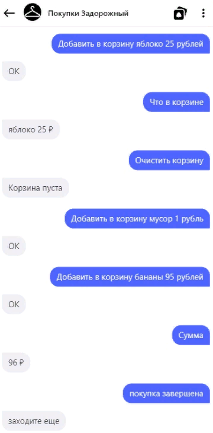

<p align="center">МИНИСТЕРСТВО НАУКИ  И ВЫСШЕГО ОБРАЗОВАНИЯ РОССИЙСКОЙ ФЕДЕРАЦИИ<br>
Федеральное государственное автономное образовательное учреждение высшего образования<br>
"КРЫМСКИЙ ФЕДЕРАЛЬНЫЙ УНИВЕРСИТЕТ им. В. И. ВЕРНАДСКОГО"<br>
ФИЗИКО-ТЕХНИЧЕСКИЙ ИНСТИТУТ<br>
Кафедра компьютерной инженерии и моделирования</p>
<br>
<h3 align="center">Отчёт по лабораторной работе № 1<br> по дисциплине "Программирование"</h3>
<br><br>
<p>студента 1 курса группы ИВТ-б-о-201(1)<br>
Задорожного Глеба Алексеевича<br>
направления подготовки 09.03.01 "Информатика и вычислительная техника"</p>
<br><br>
<table>
<tr><td>Научный руководитель<br> старший преподаватель кафедры<br> компьютерной инженерии и моделирования</td>
<td>(оценка)</td>
<td>Чабанов В.В.</td>
</tr>
</table>
<br><br>
<p align="center">Симферополь, 2020</p>
<hr>


## <p align="center">Лабораторная работа №1 Погода
## Цель: 
Закрепить навыки разработки многофайловыx приложений;<br>
Изучить способы работы с API web-сервиса;<br>
Изучить процесс сериализации/десериализации данных в/из json;<br>
Получить базовое представление о сетевом взаимодействии приложений;<br>


## Постановка задачи
Разработать сервис предоставляющий данные о погоде в городе Симферополе на момент запроса.  В качестве источника данных о погоде используйте: http://openweathermap.org/. В состав сервиса входит: серверное приложение на языке С++ и клиентское приложение на языке Python.

Серверное приложение (далее Сервер) предназначенное для обслуживания клиентских приложений и минимизации количества запросов к сервису openweathermap.org. Сервер должен обеспечивать возможность получения данных в формате JSON и виде html виджета (для вставки виджета на страницу будет использоваться iframe).

Клиентское приложение должно иметь графический интерфейс отображающий сведения о погоде и возможность обновления данных по требованию пользователя.


## Ход работы

Для получения API Key я зарегистрировался на сайте http://openweathermap.org/. После регистрации в разделе <br>
My API Keys я сгенерировал API Key. 

> Мой API Key: 4b574cac6c8640cdd2713e78e60469e2.


В разделе openweathermap.org -> API -> One Call API изучил построение http-запросов.
Составил запрос на получение прогноза погоды для Симферополя с почасовым интервалом, в градусах Цельсия, на русском языке;

> Запрос: http://api.openweathermap.org/data/2.5/onecall?lat=44.957191&lon=34.11079&exclude=minutely&lang=ru&units=metric&appid=4b574cac6c8640cdd2713e78e60469e2

Протестировал запрос в браузере. Ответ изучил в виде дерева, при помощи https://jsonviewer.io/tree.

Составил запрос для получения времени в Симферополе при помощи сервиса worldtimeapi.org и изучил формат ответа: 

> Запрос: http://worldtimeapi.org/api/timezone/Europe/Simferopol


Полный исходный код серверного приложения;

```C++
#include <iostream>
#include <cpp_httplib/httplib.h>
using namespace std;
using namespace httplib;
#include <string>
#include <cmath>
#include <fstream>
#include <iomanip>
#include <nlohmann/json.hpp>
using json = nlohmann::json;
void gen_response(const Request& req, Response& res) {
    Client cli("http://worldtimeapi.org");
    auto resd = cli.Get("/api/timezone/Europe/Simferopol");
    Client cliw("api.openweathermap.org");
    auto wsi = cliw.Get("/data/2.5/onecall?lat=44.957191&lon=34.11079&exclude=minutely&lang=ru&units=metric&appid=4b574cac6c8640cdd2713e78e60469e2");
    if (resd && wsi) {
        // Проверяем статус ответа, т.к. может быть 404 и другие
        if (resd->status == 200 && wsi->status == 200) {
            //Проблем нет
            string wordtime = resd->body;
            json j = json::parse(wordtime);
            int unixtimenow = j["unixtime"]; // МСК
            string wordwea = wsi->body;
            json h = json::parse(wordwea);//Массив погоды Hourly ,temp, icon, description, dt
            json cache;
            // если максимальный юникс прогноза + 1 час >= нынешнего проверка по кешу иначе создание кеша + новый прогноз
            //достать кеш
            ifstream src("cache.json");
            if (src)
            {
                src >> cache;
            }
            
                double tempNOW;
                string descriptionNOW;
                string iconNOW;
                if (empty(cache)) {
                    cache["hourly"][47]["dt"] = 0;
                }
            if (int(cache["hourly"][47]["dt"]) + 3600 >= unixtimenow) {
                for (int i = 0; i < 48; i++)
                {
                    if (abs(unixtimenow - cache["hourly"][i]["dt"]) <= 3600) {
                        tempNOW = cache["hourly"][i]["temp"];
                        descriptionNOW = cache["hourly"][i]["weather"][0]["description"];
                        iconNOW = cache["hourly"][i]["weather"][0]["icon"];

                        break;
                    }
                }

            }
            else {
                tempNOW = h["hourly"][0]["temp"];
                descriptionNOW = h["hourly"][0]["weather"][0]["description"];
                iconNOW = h["hourly"][0]["weather"][0]["icon"];
                ofstream srco("cache.json");
                srco << h;
            }
            ////к этому моменту в любом исходе необходимы данные иконки описания и температуры  tempNOW descriptionNOW iconNOW
            ifstream file("nowvisual.html"); // Файловая переменная
            string str;                 // Буфер. Тут будет текст файла
            getline(file, str, '\0');// str html страница изменить значения temp*2
            //// Конструкция замены html данными
            string word1 = "{hourly[i].weather[0].description}";
            string word2 = "{hourly[i].weather[0].icon}";
            string word3 = "{hourly[i].temp}";
            int num1 = size(word1);
            int num2 = size(word2);
            int num3 = size(word3);
            str.replace(str.find(word1), num1, descriptionNOW);
            str.replace(str.find(word3), num3, to_string(int(round(tempNOW))));
            str.replace(str.find(word3), num3, to_string(int(round(tempNOW))));
            str.replace(str.find(word2), num2, iconNOW);
            //// fin html
        /*  cout << str;*/// console check info
            res.set_content(str, "text/html");// Вывод
        }
        else {
            cout << "Status code: " << resd->status << endl;
        }
    }
    else {
        auto err = resd.error();
        cout << "Error code: " << err << endl;
    }
}

void gen_responseraw(const Request& req, Response& res) {
    Client cli("http://worldtimeapi.org");
    auto resd = cli.Get("/api/timezone/Europe/Simferopol");
    Client cliw("api.openweathermap.org");
    auto wsi = cliw.Get("/data/2.5/onecall?lat=44.957191&lon=34.11079&exclude=minutely&lang=ru&units=metric&appid=4b574cac6c8640cdd2713e78e60469e2");
    if (resd && wsi) {
        // Проверяем статус ответа, т.к. может быть 404 и другие
        if (resd->status == 200 && wsi->status == 200) {
            //Проблем нет
            string wordtime = resd->body;
            json j = json::parse(wordtime);
            int unixtimenow = j["unixtime"]; // МСК
            string wordwea = wsi->body;
            json h = json::parse(wordwea);//Массив погоды Hourly ,temp, icon, description, dt
            json cache;
            // если максимальный юникс прогноза + 1 час >= нынешнего проверка по кешу иначе создание кеша + новый прогноз
            //достать кеш
            //Получение кеша
            ifstream src("cache.json");
            
            if (src)
            {
                src >> cache;
            }

            double tempNOW = 0;
            string descriptionNOW;
            string iconNOW;
            if (empty(cache)) {
                cache["hourly"][47]["dt"] = 0;
            }
            if (int(cache["hourly"][47]["dt"]) + 3600 >= unixtimenow) {
                // Есть прогноз
                for (int i = 0; i < 48; i++)
                {
                    if (abs(unixtimenow - cache["hourly"][i]["dt"]) <= 3600) {
                        tempNOW = cache["hourly"][i]["temp"];
                        descriptionNOW = cache["hourly"][i]["weather"][0]["description"];
                        iconNOW = cache["hourly"][i]["weather"][0]["icon"];

                        break;
                    }
                }
            }
            else {
                // Прогноза нет
                tempNOW = h["hourly"][0]["temp"];
                descriptionNOW = h["hourly"][0]["weather"][0]["description"];
                iconNOW = h["hourly"][0]["weather"][0]["icon"];
                // ..Новый кеш
                ofstream srco("cache.json");
                srco << h;
            }
            json str;
            str["temp"] = to_string(int(round(tempNOW)));
            str["description"] = descriptionNOW;
            /*cout << str;*/
            res.set_content(str.dump(), "text/json");
        }
        else {
        cout << "Status code: " << resd->status << endl;
        }
    }
    else {
    auto err = resd.error();
    cout << "Error code: " << err << endl;
    }
}
int main() {
    Server svr;                
    svr.Get("/", gen_response);    // Виджет
    svr.Get("/raw", gen_responseraw);  // Данные для клиента
    std::cout << "Start server... OK\n";
    svr.listen("localhost", 3000);
}
```

Полный исходный код клиентского приложения;
```Python
def left_click(event):
    r = requests.get('http://localhost:3000/raw') 
from tkinter import *
import requests 
import json
jsona = []
r = requests.get('http://localhost:3000/raw') 
jsona = r.text
parsed_string = json.loads(jsona)
root =  Tk()
label1 = Label(root,font='MicrosoftSansSerif 11 bold',text = "Симферополь",bg="Gold")
label2 = Label(root,height="1",font='MicrosoftSansSerif 10',text = parsed_string["description"].encode('l1').decode(),bg="Gold")
label3 = Label(root,font='MicrosoftSansSerif 44 bold',height=2,bg="white",text = parsed_string["temp"]+"°С")
frame1 = Frame(root,height=35,bg="Gold")
label1.pack(fill=X)
label2.pack(fill=X)
label3.pack(fill=X)
frame1.pack(fill=X)
root.bind("<Button-1>",left_click)
root.mainloop()
```
<br>

Скриншот графического интерфейса клиентского приложения.<br>
<br>
Рис.1 Графический интерфейс на Tkinter<br><br>
Скриншот браузера с загруженными виджетом.<br>
<br>
Рис.2 Виджет.<br>
## Вывод: 

Закрепил навыки разработки многофайловыx приложений;
Изучил способы работы с API web-сервиса;
Изучил процесс сериализации/десериализации данных в/из json;
Получил базовое представление о сетевом взаимодействии приложений;